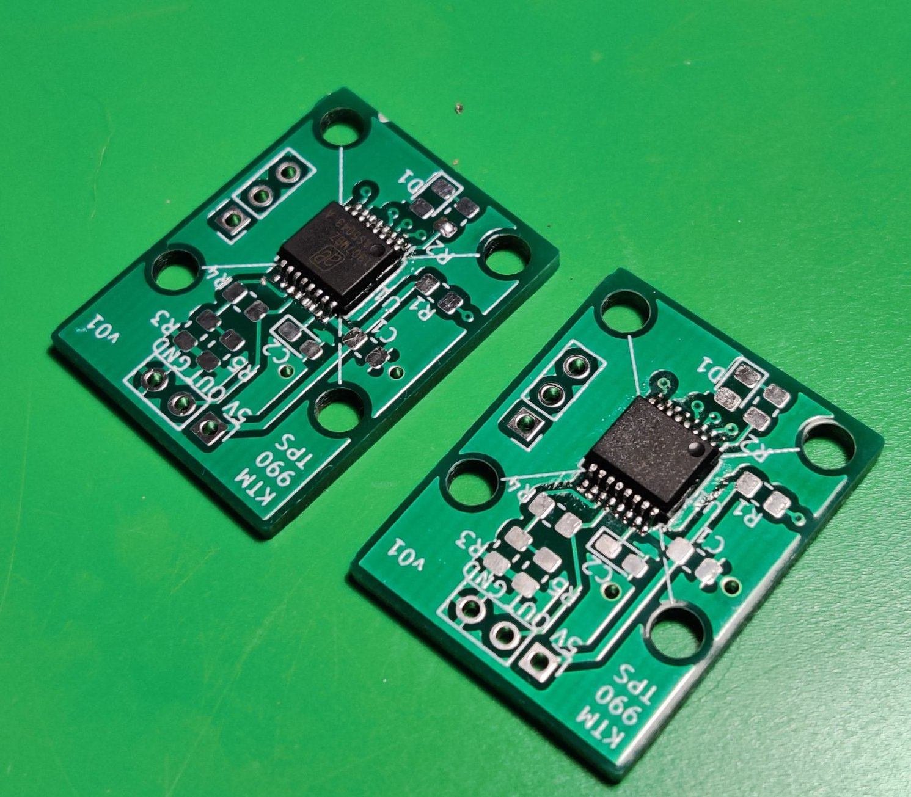

# Re-engineering a KTM Throttle Position Sensor

This a repository where I gathered and intend to update all the things related to the KTM 990 TPS. The sensor in those motorcycles is based on a potentiometer, and wears out quickly (head to [Original TPS](/reference/Original.md) for details). As such, I decided to try and create a hall-effect based replacement, as has become the industry standard.

## Work log

### 2021-02-19

The PCBs and magnets (6x2mm) arrived. I assembled them:

And mounted in the prototype casings, that I'll commit in a second to the v01 folder. Soldering the chips went quite easily, same with passive parts, even though they might not look as great. Because of limited availability of the passive parts, I decided to go with a voltage divider with 17k4 and 24k3 resistors, giving me slightly too low gain (2.4 vs 2.56 necessary for 90 degrees); that being said, the test was an astounding success, with everything clicking in place just fine, and the sensor immediately reporting stable, predictable readings.

My first idea was to mount the board "chip side up", but the thickness and material of the board in between the magnet and the sensor caused it to have bad, intermittent readings. Flipping the board 180 degrees solved that issue completely. I'll need to add some minor spaces to leave a tiny airgap, because when the magnet touches the chip it's a bit too strong, but otherwise it seems to work fine.

One downside of that orientation is that I'll need to use One-Time Programming to reverse the reported direction, as by default it goes the wrong way. Looking from the TB side, the shaft turns to the left, and by default, with chip facing the magnet, it's turning to the right that increases the voltage. Thankfully I left programming pins on the PCB, so that should go fine.

Another issue I've encountered was that my prototype casing was hard to desing with a screw hole; given the PCB size and the bearing diameter, there's simply very little space to fit one. The next order of business is rectifying that issue somehow.

I also decided that it's the right time to tackle the issue of the spring. My research shows that I'll need around 80Nmm of peak torque at 90 degrees of rotation (actually a bit more than that, because the original sensor has some space around for calibration). This translates to e.g. 1mm thick stainless steel wire with 5 wraps and an outer diameter of 12mm (inner 10mm). Other configurations are possible, and I'll try to order some wire and do some practical experiments. I think making the holes holding the spring itself shouldn't be _that_ hard, but I also need to consider the assembly process. 

### 2021-01-14

I created this repo and gathered all the files. I also filled out all the entries below retroactively, to keep the development history intact. The project moves on, and I'm currently ordering the SMD parts, waiting for the PCBs to be fabricated and starting the CAD work for the v01 3D-printed case that will hold the new round magnet and the new PCB.

### 2021-01-10

Since the AS5043 is only available in a SSOP-16 SMD package, I wouldn't be able to use it without some breakout board. I decided to create and order a custom PCB for it, that included resistors necessary for an appropriate voltage mapping, and a breakout for programming the unit. The PCB is in the `PCB` folder.

### 2021-01-08

During the research about the AS5043 I found [this experiment][6] led by two guys. They originally planned to create a precise motor controller for a resin 3D-printer. The whole method led me to believe that it's totally doable to build a precise sensor with that chip. I also found some interesting devkits from AMS, utilizing [a simple shaft in a piece of acrylic][8], simply holding the magnet on top of the chip (even without any bearings). Despite the datasheet talking about quite strict positioning tolerances, those seemed to work well enough.

Some additional materials include:
 * [the user manual][7]

### 2021-01-04

I learned about the existence of [AS5043][5] and the line of those sensors. I still felt there's a lot to be learned from the linear sensor-based approach, but since I could order a few samples, I've decided to give those a shot. They seemed much more straightforward to set up and were specifically designed for potentiometer replacement / TPS use. The samples arrived very quickly, which prompted me to go with that option for now.

I have ordered special radially-polarized magnets for them, too. There's a [special magnet guide][9], but the ones I got were 6mm ones specially labeled for rotation sensors.

### 2021-01-02

I got myself a 3D printer and fabricated some of my CAD drafts. They came out well, and allowed for much better tolerances, which in turn meant much better sensor readings. It was still oversaturated, and required being pulled out of the center of the magnets, which probably didn't help the linearity. Around that time I found the [Infineon TPS Application note][4] as well as [the datasheet for their programmable sensor][3]. I wasn't yet very concerned with the electric signals, as I was quite sure I can get the voltage to my desired range using a couple op-amps.

In fact, I did some early tests with an LM258P that seemed to give good results. The maximum voltage achievable with 5V supply is about 3.8V, so about right what the sensor needs to produce.

### 2020-11-16

I switched to a free version of Siemens Solid Edge, which helped in the modelling. I have ordered A1324 sensors and bearings and started doing some testing. Those early tests have shown that the sensor is really sensitive to positioning, and simply holding near the magnet won't work.

At first, I tried to put one magnet in the middle of the shaft, and put the sensor to the side, to simplify the construction. This was a complete failure, with wildly varying readings. 

The next tryout utilized a shaft (I used 8mm woodworking pins) drilled longitudinally, with two magnets glued on the sides like in the reference design. This creates a much more linear magnetic field near the sensor. I would later learn that even stronger alignment of the field might be necessary, described in [this application note][4]. I have also learned that the two magnets I used were much too strong and were oversaturating the sensor.

### 2020-09-09 - "official start of the project"

I started with [a forum post on AdvRider.com][1] where I gathered the dimensions of the original unit after mine has failed a second time and created a model in FreeCAD. This model can be found in the `CAD/old-freecad` folder.

One of the biggest inspirations for me was [this post][2] on SimHQ forum, describing creation of custom potentiometers for simulation use, utilizing linear hall-effect sensors from Allegro microsystems.

 [1]: https://advrider.com/f/threads/990-throttle-position-sensor-tps-adjustment-video-how-to.1448666/#post-40815732
 [2]: https://simhq.com/forum/ubbthreads.php/topics/3674791/DIY_Sealed_Minature_Hall_Pots
 [3]: https://www.infineon.com/dgdl/Infineon-TLE4997E2-DataSheet-v02_10-EN.pdf?fileId=db3a30431ce5fb52011d3e4c832a2594
 [4]: https://www.infineon.com/dgdl/TLE499x_AppNote_Throttle_Position_Sensing_v1.0.pdf?fileId=db3a30431ce5fb52011d29cc328a1bd2
 [5]: https://ams.com/as5043
 [6]: https://web.archive.org/web/20160315230856/http://sindri.sebastians-site.de/MagneticRotaryEncoder
 [7]: https://ams.com/documents/20143/36005/AS5043_UG000105_1-00.pdf/bf8c0c98-c7ba-e6d1-0d0d-d9de9658eb91
 [8]: https://ams.com/rmh05-dk-xx
 [9]: https://ams.com/documents/20143/36005/AnglePositionOnAxis_AN000271_2-00.pdf/d3bc1235-a3da-7e15-15bf-624e9ff0c389