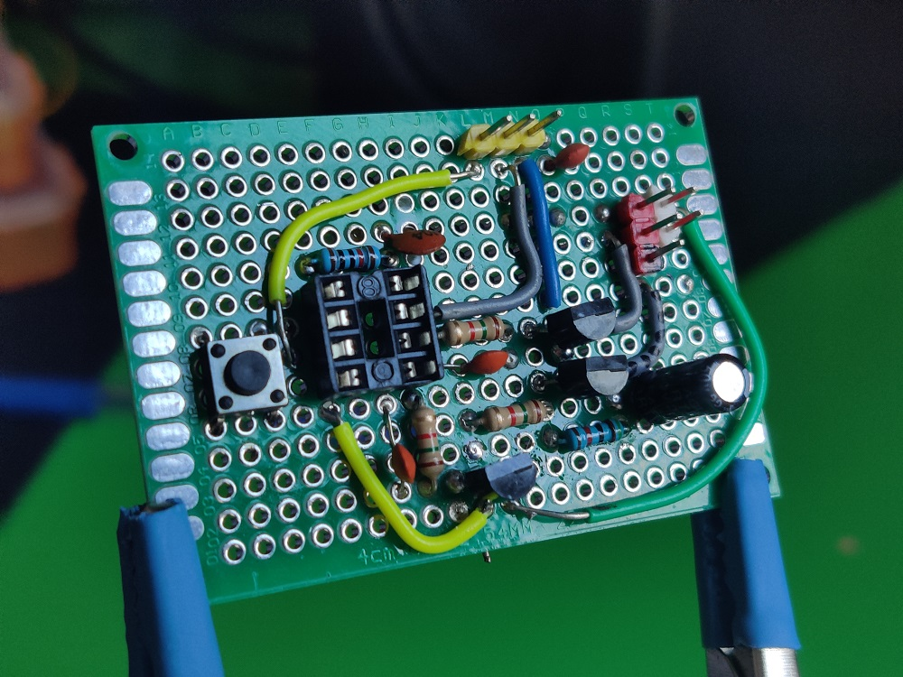
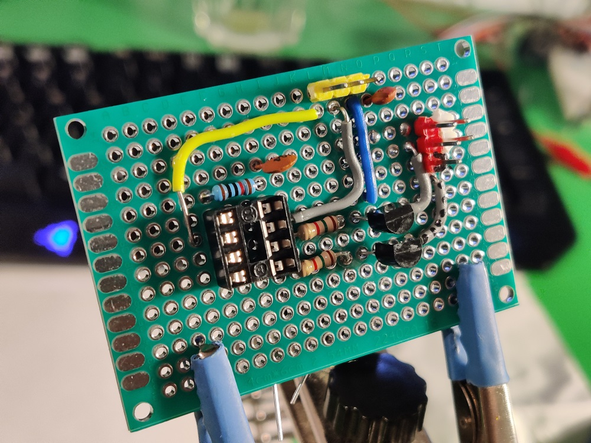
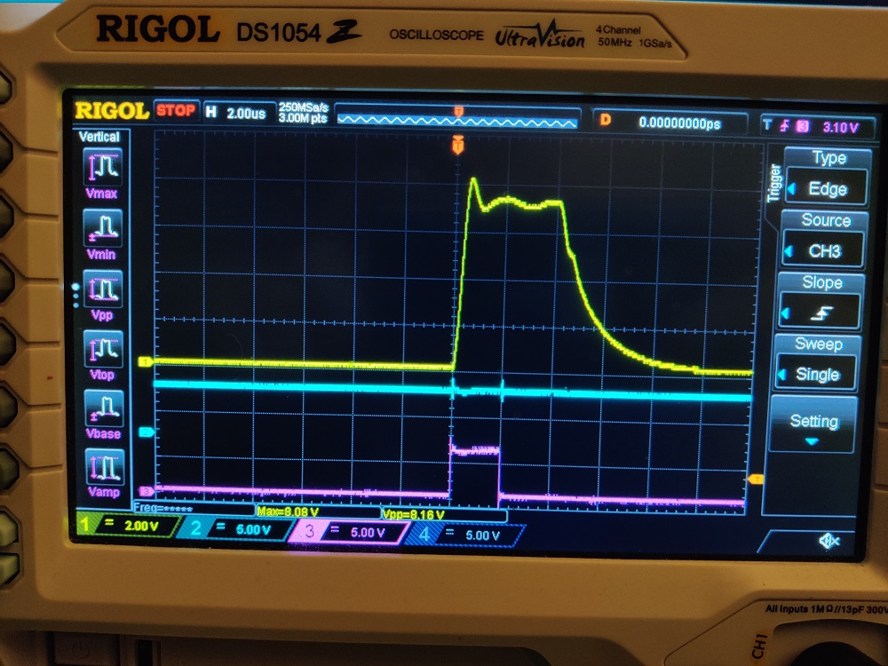
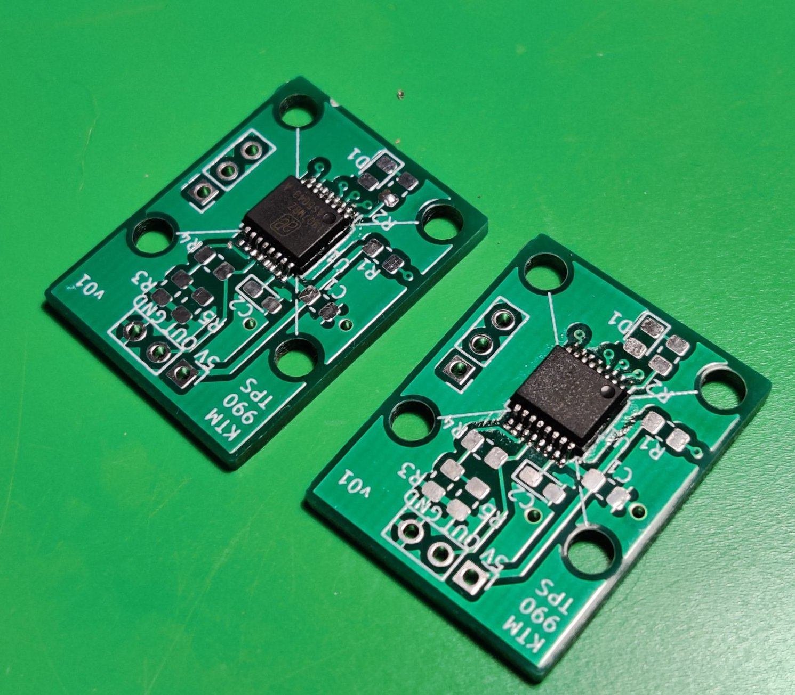

# Re-engineering a KTM Throttle Position Sensor

This a repository where I gathered and intend to update all the things related to the KTM 990 TPS. The sensor in those motorcycles is based on a potentiometer, and wears out quickly (head to [Original TPS](/reference/Original.md) for details). As such, I decided to try and create a hall-effect based replacement, as has become the industry standard.

## Work log

---

### 2021-09-19

Unfortunately, I got a bit stuck, and with the weather being nice, i just didn't make too much progress. I hope the coming winter months will give me a better time.

The biggest hurdle right now is fixing the dev board in. So far, while I was finally able to print the properly dimensioned pins (using the Cura's "modify mesh settings" to selectively slow down and increase infill for them), the dev board was just made so imprecisely that I couldn't get it to fit nicely. I just need to design my own board and order from JLC again, as that's proven to work way better. I can also include enough space for the mounting screw then.

As far as 3D printing goes, I did some research, and while Nylon (PA12) would be ideal for this application, basing on some tests I found online PLA is actually quite resistant to gasoline! I've mentioned that the ASA parts were disappointing, but I think I'm just going to go with PLA for the first truly functional prototype.

There is an additional thing worth mentioning. While searching the internet, I found a very similarly looking TPS unit, going around for around $20 - supposedly for Polaris vehicles. The physical dimensions look exactly the same, and some tests made on the forum seem to suggest that it might actually be electrically compatible. It has the wrong plug (the opposite sumimoto connector), but that's an easy fix. I've actually ordered one months ago, but Amazon has dropped the ball, so I'm waiting for a package from Aliexpress right now to do my own testing. I am not planning to abandon my project if it turns out to be a drop-in replacement, but it might be a good option for a lot of people.

---

### 2021-07-03

After over two months of waiting, I got a refund for the parts I've ordered and subsequently reordered them. They arrived a few days ago, and I was able to get back on track pretty quickly. This still required some nontrivial operations, though.

First off, in order to speed things up, I've ordered the sensors already soldered on a "development-kit" style of boards. They expose all the pins (7 on the board, because the chip has two Vcc pins, one for 3V3 and one for 5V) and come with convenient passive components. That "convenience" was actually quite problematic, because the way the chip is configured, it doesn't even produce an analog output at all! The R4 resistor puts it in a "programming" mode (the datasheet essentially allows it to be programmed by mechanical placement of the magnet and easy operations even without using I2C at all), so it had to be removed. Similarly, the R1 0Ohm resistor bridges the Vcc pins for 3V3 operation, and the chip works just fine at 5V after I got rid of it. I didn't have to reverse-engineer the board, so thanks to that one random Russian Aliexpress customer that put all of that information in his review.

The board has convenient 4mm mounting holes which I initially assumed to be spaced by 15mm. I took my ready CAD file, got rid of the perimeter plastic around the board (the new one wouldn't fit, anyway) and moved the pins around. That has proven to be an utter failure. Removing the wall around the pins meant that they had much less time to cool on every layer, so they came out as poorly defined blobs that broke out even before I got the print off the bed. No worries, though, as the board didn't fit anyway, with the holes apparently being spaced 16mm in one direction and **15.5mm** in the other. Eek. I just used wood screws to hold the board in place, for now. In fact, those sensors are so good that even holding the magnet in your fingers above the surface produces reasonable results! Compared to my earlier attempts with linear hall sensors, this is a huge difference.

As far as screws go, I was able to find a reasonable mounting screw for now, but I definitely need to redesign the PCB so that it's shorter on one end, because it does get annoying. Having more clearance near the screw would be really helpful.

That being said, after hooking up the direction pin to Vcc (this is a huge benefit of using the 5600 over the 5043!) for counter-clockwise-positive operation and putting it on the TB set, it worked just fine - albeit ratiometrically over 360 degrees. That was already great, though, as the chip can be straightforwardly programmed over just I2C with no HV required. In fact, instead of writing my own library, I used this [excellent example][11] with a human-friendly interface. Unfortunately during testing, even though I only wanted to play with runtime setting, I must've fat-fingered something and burned the angle settings in. Thankfully, the chip can accept that 3 times, so it wasn't bricked just yet.

> Note: The sensor has two possibilities of range settings that were (and still are) a bit confusing to me. Either you write into the MANG (angle) register to set the range of operation, or you write to ZPOS/MPOS to set the start and stop angles (corresponding to 0V and Vcc). Once the ZPOS/MPOS pair has been burned in, the MANG can't even be set dynamically. MANG can be burned in just once. ZPOS/MPOS can be burned in 3 times.

The software in the example works by allowing you to set the start and end values simply by rotating the magnet to appropriate position. Of course this is rather imprecise, but was enough for my testing. One more feature that it has is the raw angle display, which allowed me to more precisely measure the actual operating range of the sensor. To my surprise, it came out to only be **78 degrees**. I am not sure if the TBs have been zeroed-out prior to that, though, and will have to confirm with the original TPS. Either way, that meant that for testing I needed about 140 degrees of 0-5V sweep to get the desired mV/deg to obtain 0.6-3.8V.

This has worked beautifully. I rotated the sensor to indicate almost 0, programmed start position, turned it 140 degrees, programmed end position, and then burned the angle settings and unplugged the I2C connection. This is the first case of a successfully permanently programmed sensor that technically could go into the bike!

#### Wiring

This is also a good point to mention the wiring, as I've been working on that as well. The sensor needs to connect to the bike at the end!

For cables, I've ordered Polish-made TLWY brand ribbons, in 8x0.22mm^2, 8x0.35mm^2 and 8x0.5mm^2 (this corresponds to AWG 24, 22 and 20, respectively). They're of extremely high quality, meeting and exceeding automotive requirements. Even then, I am pretty sure that the original wiring uses AWG 18 cables, but for such a short connection I think I'm going to stick with 20.

The wire thickness is also important for the plug itself. Thanks to some research I found out that the original plugs used by KTM were originally manufactured by Sumimoto (**MT090**, 3-pin). KTM sells them, but they're about half as expensive when bought as generic automotive parts. I was very happy with my cost savings until I've realized that AliExpress has them for 1/5th the price again. Oh well, at least I'll be able to compare them.

To be quite honest, when they arrived, the only main difference seem to be the sealing rubbers. They're much firmer in the original ones, and a bit softer in the Chinese ones. I don't think this will have a huge effect. I mounted one plug so far using the TLWY wires with 1.7mm outer diameter and they seem to seal quite well. My crimping tool is technically only rated to AWG22, but it did just fine with those plugs. I'll wait until I have the casing for the dev-board prototype and will solder them on there.

I also bought a couple of the counterparts to potentially make some test setups. I think that I'll also make a usual Y-splitter to mount on the bike (just like the ones routinely used for TPS setting, even though you'd technically only need to branch that one voltage out).

#### Next steps

This was a long update written over a couple commits, but it represents a significant milestone for me. I've reached the point where I could conceivably take my sensor and plug it into a live bike, and thus its ECU, and see whether it likes the signal or not! I've realized that I don't even have to turn the engine on for that test, I can just ask TuneECU to tell me whether the computer sees the right input.

Before that happens, though, I need to create a proper casing just for the dev-board now and see how my plastic reacts to fuel vapors. I've been also thinking about putting some insulation sheet between the hole where the bearings sit and the electronics, as there need not be a direct contact there. The manual talks about an "airgap", but a thin mylar, kapton or similar sheet should work just fine.

After the unit is enclosed, has a proper screw and the plug connected, I'll consider it the first prototype ready for functional testing. There's a chance I might conduct just the electrical test first, but I see no reason why it shouldn't work with the ECU (since it presents an analog voltage just like a potentiometer would).

Of course even if the prototype works, there's still a question of a new PCB for the AS5600 (with more clearance), the spring loading (I've actually had a simpler idea that would clamp the shaft on the TB arm instead) et cetera, but there might be some things that only the functional testing of the prototype will reveal. I'd put it in my personal motorcycle if not for the fact that it needs to be ready for a long trip soon, so that'll have to wait until then.

---

### 2021-06-14

I've ordered the new sensor from Aliexpress, but the package hasn't arrived yet. In the meantime, I've built an enclosure for my 3D printer and successfully printed some ASA parts. Unfortunately, despite having excellent temperature and UV (we'll see about fuel vapors) resistance, they're much weaker mechanically, which was a disappointment.

---

### 2021-03-28

_This update has been copied from advrider forums._

I have some news - some bad, some good, but worth an update nonetheless.

The video from 2021-03-22 was showing the sensor programmed non-permanently. It had the configuration I needed, but once I resetted it (or cut power) it would go back to stock settings. The special programmer I tried to build was supposed to solve that and allow me to make the settings permanent.

I spent a week on it and got it to the point where I was pretty sure it was going to work, confirming the "correct" operation down to microseconds. Then I plugged the sensor in and... well, bricked it. It received some configuration, but decidedly not what I needed.

I still have a few units left, so I might try to fix the issues with this board, but meanwhile I've found yet another sensor (AS5600) that's:

- a newer design
- more accurate (12 vs 10 bits)
- much easier to program (no special programmer at all) - in fact, the rotation direction has a dedicated pin...
- much easier to solder (SOIC-8 vs SSOP-16)
- 6 times cheaper and easier to obtain
- also automotive-use qualified

I can only kick myself for not noticing it earlier. I think it should be a perfect replacement; I'm going to order some and try to work on the new plans. I wanted to make a V2 PCB anyway, to change the shape and make it easier to fit the mounting screw in the casing. The only downside is waiting for the PCBs to be made again, but after the first run I got more confident in being able to get them to work. I'll try ordering some pre-mounted boards with the new sensor as well to see if I can test it in practice even before my own PCBs are ready. Of course this means I'll need to alter the CAD designs too.

I could probably attack the programmer again and try to get it to work, but I think that at this point the time is better spent into preparing the new sensor; if only for the lower cost and much wider availability!

So while this is a bit of a hiccup, and my next iteration will take about a month to a month and a half to get all parts here, I think I've amassed enough experience to make it much closer to the final product.

In the meantime I might finally take a stab at setting up my 3D-printer for high-temperature materials to see if I'll be able to get a casing what would be usable in a real-world scenario.

---

### 2021-03-25

This is actually a summary of a few days of progress. I started working on the permanent OTP programmer for the AS sensor. I've designed a schematic and built it up on a prototype board from DIP parts. My initial idea was to utilize an ATtiny MCU programmed with the specific bit vector, but for the testing I just plugged the Uno into the DIP 8 socket.

This is the early version of the programmer board when I still thought I could get away with just two transistors. Since then I've severly modified the schematic to utilize a proper NPN driver and added caps across transistor base resistors to improve the shut-off time. The image below shows the delay that was caused by what's apparently called "Miller capacitance" or "charge storage", which I learned on [Electronics.se][10].

I also tried to generate pulses of exactly 2us; that turned out to be quite straighforward using the ATmega's Timer capabilities. The code showcasing that use is in `programmer/code/atmega328p_2u_pulse`.

An important realization I had was that the PROG timings aren't actually that crucial; it's the CLK timings that matter. At first I thought that I'll need to drive the HV line with that accuracy, but I can split the problem up. The PROG line needs to be driven consistently and with not too many transients (check) and the CLK line needs to generate exact 2us pulses (check). I think I have all parts of the puzzle now, what's left now is to integrate them together.

I've also just realized that since I connected the transistors to both PWM pins of the tiny pinout, I have none left for driving the CLK clock precisely. Uh. I'll need to figure something out.

---

### 2021-03-22 

I finally soldered a header to programming pins and took a stab at programming the sensors. So far, they seem to perform the best when the sensor is directly facing the magnet (and not through the PCB), which means the default rotation (value 0 for the MSB direction bit) is wrong.

The sensor can be programmed either permanently (via OTP) or just temporarily. The OTP programming starts with a regular "write" cycle, followed by high voltage pulses that permanently burn Zener diodes inside the chip to store the configuration. The serial interface for interacting with the unit is a bit different to the SSI used for digital readout (BTW, I've realized I skipped the digital data out (DO) on the PCB, which probably wasn't a great idea in retrospect). The SSI uses a very weird signal "delayed" by one clock pulse. The maximum frequency is specified as 1MHz. In contrary, programming allows up to 250kHz comparable to Mode 0 SPI, while the actual OTP burn requires very precisely timed pulses.

My first attempts ended with the chip not responding to anything I was sending so far. All the timings for temporary programming only state maximum values, so I tried slowing down, but that didn't seem to help. I crafted completely bogus waveforms and observed them on the logic analyzer, but I only managed to get some reaction where I completely botched the programming (e.g. disconnected the clock cycle).

Then I had a realization; the non-permanent programming showed `CSn` line going down at the end of it. However, in the OTP burn cycle, the CSn doesn't go down until it ends the enire procedure. Maybe I was supposed to keep it high? Tried that, but it didn't work. In frustration, I manually jerked the CSn line and plugged it into ground... _it worked_.

https://www.youtube.com/watch?v=5MJOhFoH9Xk

I was really tired at that point after going at it for a few hours straight, so decided to only do one more test and call it a night; I added a long delay (2s) and a single up pulse on the CSn line (to mirror the jerky pulses caused by my manual operation which I managed to record on the analyzer), and that also seemed to work. So it's something around either waiting a while, or making one extra pulse on the CSn. I'll try figuring out what the next time (as well as looking at other programming bits), but nevertheless, progress!

P.S. The code for that version is in `programmer/code/as5043_prog_soft`.

---

### 2021-02-19

The PCBs and magnets (6x2mm) arrived. I assembled them:

And mounted in the prototype casings, that I'll commit in a second to the v01 folder. Soldering the chips went quite easily, same with passive parts, even though they might not look as great. Because of limited availability of the passive parts, I decided to go with a voltage divider with 17k4 and 24k3 resistors, giving me slightly too low gain (2.4 vs 2.56 necessary for 90 degrees); that being said, the test was an astounding success, with everything clicking in place just fine, and the sensor immediately reporting stable, predictable readings.

My first idea was to mount the board "chip side up", but the thickness and material of the board in between the magnet and the sensor caused it to have bad, intermittent readings. Flipping the board 180 degrees solved that issue completely. I'll need to add some minor spaces to leave a tiny airgap, because when the magnet touches the chip it's a bit too strong, but otherwise it seems to work fine.

One downside of that orientation is that I'll need to use One-Time Programming to reverse the reported direction, as by default it goes the wrong way. Looking from the TB side, the shaft turns to the left, and by default, with chip facing the magnet, it's turning to the right that increases the voltage. Thankfully I left programming pins on the PCB, so that should go fine.

Another issue I've encountered was that my prototype casing was hard to desing with a screw hole; given the PCB size and the bearing diameter, there's simply very little space to fit one. The next order of business is rectifying that issue somehow.

I also decided that it's the right time to tackle the issue of the spring. My research shows that I'll need around 80Nmm of peak torque at 90 degrees of rotation (actually a bit more than that, because the original sensor has some space around for calibration). This translates to e.g. 1mm thick stainless steel wire with 5 wraps and an outer diameter of 12mm (inner 10mm). Other configurations are possible, and I'll try to order some wire and do some practical experiments. I think making the holes holding the spring itself shouldn't be _that_ hard, but I also need to consider the assembly process. 

---

### 2021-01-14

I created this repo and gathered all the files. I also filled out all the entries below retroactively, to keep the development history intact. The project moves on, and I'm currently ordering the SMD parts, waiting for the PCBs to be fabricated and starting the CAD work for the v01 3D-printed case that will hold the new round magnet and the new PCB.

---

### 2021-01-10

Since the AS5043 is only available in a SSOP-16 SMD package, I wouldn't be able to use it without some breakout board. I decided to create and order a custom PCB for it, that included resistors necessary for an appropriate voltage mapping, and a breakout for programming the unit. The PCB is in the `PCB` folder.

---

### 2021-01-08

During the research about the AS5043 I found [this experiment][6] led by two guys. They originally planned to create a precise motor controller for a resin 3D-printer. The whole method led me to believe that it's totally doable to build a precise sensor with that chip. I also found some interesting devkits from AMS, utilizing [a simple shaft in a piece of acrylic][8], simply holding the magnet on top of the chip (even without any bearings). Despite the datasheet talking about quite strict positioning tolerances, those seemed to work well enough.

Some additional materials include:
 * [the user manual][7]

---

### 2021-01-04

I learned about the existence of [AS5043][5] and the line of those sensors. I still felt there's a lot to be learned from the linear sensor-based approach, but since I could order a few samples, I've decided to give those a shot. They seemed much more straightforward to set up and were specifically designed for potentiometer replacement / TPS use. The samples arrived very quickly, which prompted me to go with that option for now.

I have ordered special radially-polarized magnets for them, too. There's a [special magnet guide][9], but the ones I got were 6mm ones specially labeled for rotation sensors.

---

### 2021-01-02

I got myself a 3D printer and fabricated some of my CAD drafts. They came out well, and allowed for much better tolerances, which in turn meant much better sensor readings. It was still oversaturated, and required being pulled out of the center of the magnets, which probably didn't help the linearity. Around that time I found the [Infineon TPS Application note][4] as well as [the datasheet for their programmable sensor][3]. I wasn't yet very concerned with the electric signals, as I was quite sure I can get the voltage to my desired range using a couple op-amps.

In fact, I did some early tests with an LM258P that seemed to give good results. The maximum voltage achievable with 5V supply is about 3.8V, so about right what the sensor needs to produce.

---

### 2020-11-16

I switched to a free version of Siemens Solid Edge, which helped in the modelling. I have ordered A1324 sensors and bearings and started doing some testing. Those early tests have shown that the sensor is really sensitive to positioning, and simply holding near the magnet won't work.

At first, I tried to put one magnet in the middle of the shaft, and put the sensor to the side, to simplify the construction. This was a complete failure, with wildly varying readings. 

The next tryout utilized a shaft (I used 8mm woodworking pins) drilled longitudinally, with two magnets glued on the sides like in the reference design. This creates a much more linear magnetic field near the sensor. I would later learn that even stronger alignment of the field might be necessary, described in [this application note][4]. I have also learned that the two magnets I used were much too strong and were oversaturating the sensor.

---

### 2020-09-09 - "official start of the project"

I started with [a forum post on AdvRider.com][1] where I gathered the dimensions of the original unit after mine has failed a second time and created a model in FreeCAD. This model can be found in the `CAD/old-freecad` folder.

One of the biggest inspirations for me was [this post][2] on SimHQ forum, describing creation of custom potentiometers for simulation use, utilizing linear hall-effect sensors from Allegro microsystems.

 [1]: https://advrider.com/f/threads/990-throttle-position-sensor-tps-adjustment-video-how-to.1448666/#post-40815732
 [2]: https://simhq.com/forum/ubbthreads.php/topics/3674791/DIY_Sealed_Minature_Hall_Pots
 [3]: https://www.infineon.com/dgdl/Infineon-TLE4997E2-DataSheet-v02_10-EN.pdf?fileId=db3a30431ce5fb52011d3e4c832a2594
 [4]: https://www.infineon.com/dgdl/TLE499x_AppNote_Throttle_Position_Sensing_v1.0.pdf?fileId=db3a30431ce5fb52011d29cc328a1bd2
 [5]: https://ams.com/as5043
 [6]: https://web.archive.org/web/20160315230856/http://sindri.sebastians-site.de/MagneticRotaryEncoder
 [7]: https://ams.com/documents/20143/36005/AS5043_UG000105_1-00.pdf/bf8c0c98-c7ba-e6d1-0d0d-d9de9658eb91
 [8]: https://ams.com/rmh05-dk-xx
 [9]: https://ams.com/documents/20143/36005/AnglePositionOnAxis_AN000271_2-00.pdf/d3bc1235-a3da-7e15-15bf-624e9ff0c389
 [10]: https://electronics.stackexchange.com/questions/555440/transistor-turns-off-only-after-a-delay
 [11]: https://github.com/Seeed-Studio/Seeed_Arduino_AS5600
